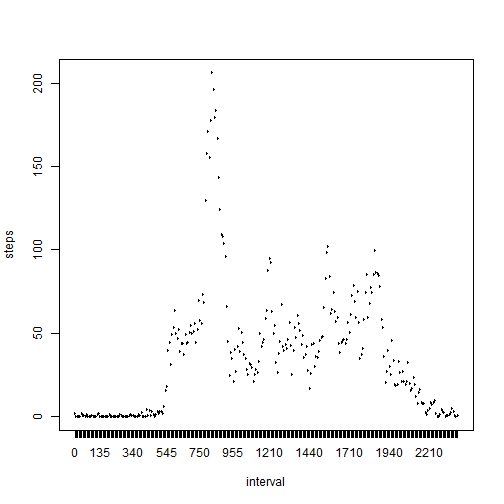
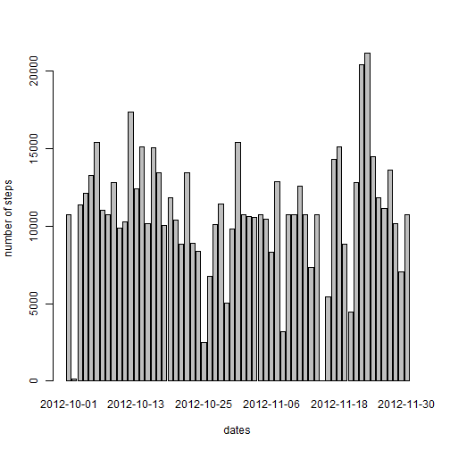
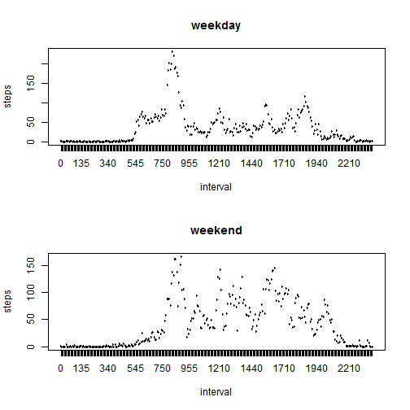

This assignment makes use of data from a personal activity monitoring device. This device collects data at 5 minute intervals through out the day. The data consists of two months of data from an anonymous individual collected during the months of October and November, 2012 and include the number of steps taken in 5 minute intervals each day.

### Loading and preprocessing the data
#### Show any code that is needed to
#### 1. Load the data (i.e. read.csv())


```r
activity <- read.csv("activity.csv")
```

#### 2. Process/transform the data (if necessary) into a format suitable for your analysis
The following code is needed to format the data for processing, specifically to convert the date field to Date class and interval field to Factor class.


```r
activity$date <- as.Date(activity$date, format = "%Y-%m-%d")
activity$interval <- as.factor(activity$interval)
str(activity)
```

```
## 'data.frame':	17568 obs. of  3 variables:
##  $ steps   : int  NA NA NA NA NA NA NA NA NA NA ...
##  $ date    : Date, format: "2012-10-01" "2012-10-01" ...
##  $ interval: Factor w/ 288 levels "0","5","10","15",..: 1 2 3 4 5 6 7 8 9 10 ...
```

### What is the mean total number of steps taken per day?
#### 1. Make a histogram of the total number of steps taken each day

 

#### 2. Calculate and report the mean and median total number of steps taken per day


```r
mean(steps_per_day$steps)
```

```
## [1] 10766
```

```r
median(steps_per_day$steps)
```

```
## [1] 10765
```

### What is the average daily activity pattern?
#### 1. Make a time series plot (i.e. type = "l") of the 5-minute interval (x-axis) and the average number of steps taken, averaged across all days (y-axis)


```r
steps_per_interval <- aggregate(steps ~ interval, data=activity, FUN=mean)
plot(steps_per_interval, type="l")
```

 

#### 2. Which 5-minute interval, on average across all the days in the dataset, contains the maximum number of steps?


```r
steps_per_interval$interval[which.max(steps_per_interval$steps)]
```

```
## [1] 835
## 288 Levels: 0 5 10 15 20 25 30 35 40 45 50 55 100 105 110 115 120 ... 2355
```

### Imputing missing values
#### 1. Calculate and report the total number of missing values in the dataset (i.e. the total number of rows with NAs)


```r
sum(is.na(activity))
```

```
## [1] 2304
```

#### 2. Devise a strategy for filling in all of the missing values in the dataset. The strategy does not need to be sophisticated. For example, you could use the mean/median for that day, or the mean for that 5-minute interval, etc.

For the missing values, I will use the means from the 5-minute intervals.

#### 3. Create a new dataset that is equal to the original dataset but with the missing data filled in.


```r
activity <- merge(activity, steps_per_interval, by="interval", suffixes=c("",".y"))
na_temp <- is.na(activity$steps)
activity$steps[na_temp] <- activity$steps.y[na_temp]
activity <- activity[,c(1:3)]
```

#### 4. Make a histogram of the total number of steps taken each day and Calculate and report the mean and median total number of steps taken per day. Do these values differ from the estimates from the first part of the assignment? What is the impact of imputing missing data on the estimates of the total daily number of steps?


```r
steps_per_day <- aggregate(steps ~ date, data=activity, FUN=sum)
barplot(steps_per_day$steps, names.arg=steps_per_day$date, xlab="dates", ylab="number of steps")
```

 

```r
mean(steps_per_day$steps)
```

```
## [1] 10766
```

```r
median(steps_per_day$steps)
```

```
## [1] 10766
```

The impact is minimal as the results are not significantly different.

### Are there differences in activity patterns between weekdays and weekends?
Use the dataset with the filled-in missing values for this part.

#### 1. Create a new factor variable in the dataset with two levels - "weekday" and "weekend" indicating whether a given date is a weekday or weekend day.


```r
day_of_week <- function(date) {
  if (weekdays(as.Date(date)) %in% c("Saturday", "Sunday")) {
    "weekend"
  } else {
    "weekday"
  }
}
activity$day_of_week <- as.factor(sapply(activity$date, day_of_week))
```

#### 2. Make a panel plot containing a time series plot (i.e. type = "l") of the 5-minute interval (x-axis) and the average number of steps taken, averaged across all weekday days or weekend days (y-axis).


```r
par(mfrow=c(2,1))
steps_weekday <- aggregate(steps ~ interval, data=activity, subset=activity$day_of_week=='weekday', FUN=mean)
plot(steps_weekday, type="l", main="weekday")
steps_weekend <- aggregate(steps ~ interval, data=activity, subset=activity$day_of_week=='weekend', FUN=mean)
plot(steps_weekend, type="l", main="weekend")
```

 

